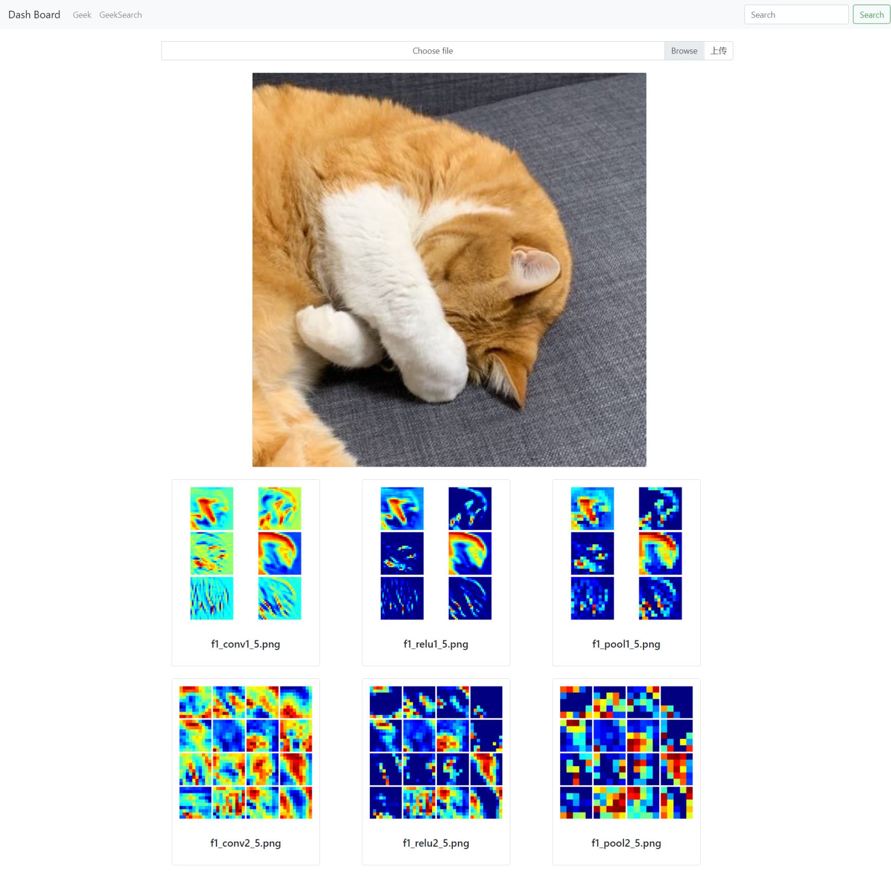
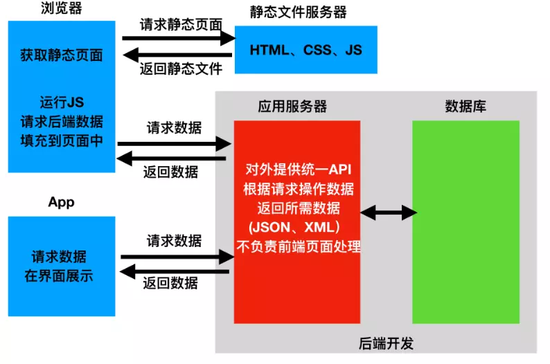

# AI_Platform

## 效果展示

## TODO

- [ ] REST Framework 前段后端分离

  

  

## 参考

网页标注平台

* [COCO Annotator](https://github.com/jsbroks/coco-annotator)
* [Label Studio](https://github.com/heartexlabs/label-studio)
* [Computer Vision Annotation Tool (CVAT)](https://github.com/opencv/cvat)

超参自动优化工具

* [Talos](https://github.com/autonomio/talos)
* [Hpman](https://github.com/megvii-research/hpman)
* [Optuna: A hyperparameter optimization framework](https://github.com/optuna/optuna)

实验管理工具

* [RunX](https://github.com/NVIDIA/runx)
* [Sacred: Sacred is a tool to help you configure, organize, log and reproduce experiments developed at IDSIA.](https://github.com/IDSIA/sacred)

分布式训练框架

* [Horovod](https://github.com/horovod/horovod)
* [BytePS: A high performance and generic framework for distributed DNN training](https://github.com/bytedance/byteps)

在线模型压缩加速

* [一键转换 Caffe, ONNX, TensorFlow 到 NCNN, MNN, Tengine：基于WebAssembly](https://convertmodel.com/)